<p align="center">
  
</p>

<h1 align="center">Malagueña</h1>

<p align="center"><em>A programmer's approach to guitar.</em></p>

Malagueña is the song that made me pick up and try the guitar again. This app holds all the tools for you to pick up the guitar again: a library of tab music, a guitar tuner, a metronome and daily practice routines.

No sign-ups, upsells, subscriptions, ad breaks or popups.

## What's inside

- **Routines** — timed practice sessions, segment by segment: exercises, breaks and free play, each with its own tempo. Tap a segment to jump to it; the metronome and playhead follow.
- **Tabs** — plain ASCII tab, treated the way a programmer would: every note column is a beat, the time signature is inferred from the bars, systems re-wrap to fit whatever screen you're on. An amber playhead walks the sheet in time with the metronome, and two clicks set an A–B loop for drilling a passage.
- **Metronome** — drift-free clicks scheduled on the Web Audio clock, with tempo markings, tap tempo, an accent toggle and a one-bar count-in.
- **Tuner** — autocorrelation pitch detection from the microphone. It follows whichever string you play, tells you how far off you are and which way to turn, and rings a small bell when you land.
- **Admin** — a fret-grid editor for writing tabs without touching a single dash, plus a routine builder. Behind its own password; the public site stays read-only.

It's a PWA: install it on a phone and the practice room works offline.

## Running it

Rails 8, Hotwire, SQLite, no JavaScript dependencies. The usual:

```sh
bin/setup
bin/rails server
```

Content is seeded through the console or created in `/admin`.

## Deploying

Ships as a Docker container via [Kamal](https://kamal-deploy.org):

```sh
bin/kamal setup    # first time
bin/kamal deploy   # every time after
```

---

<p align="center"><sub>Built by <a href="https://bramjanssen.eu">Bram</a> — with a warm coffee and a napping cat.</sub></p>
